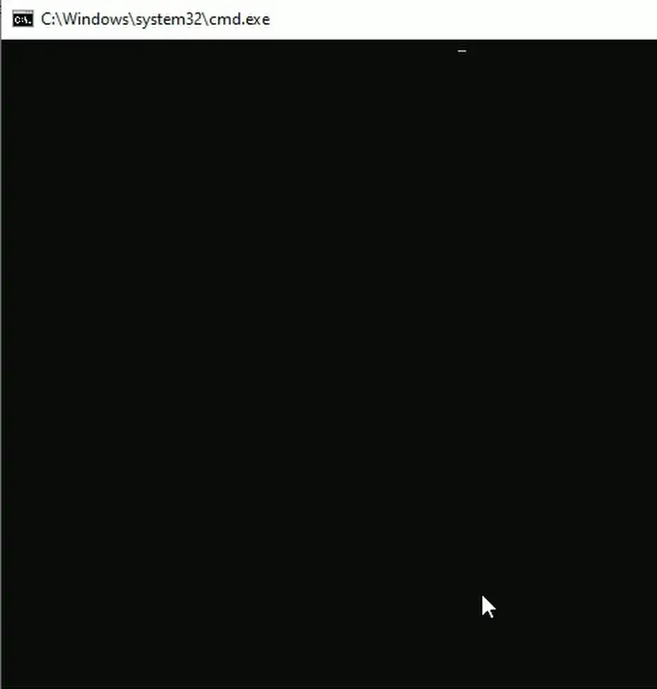
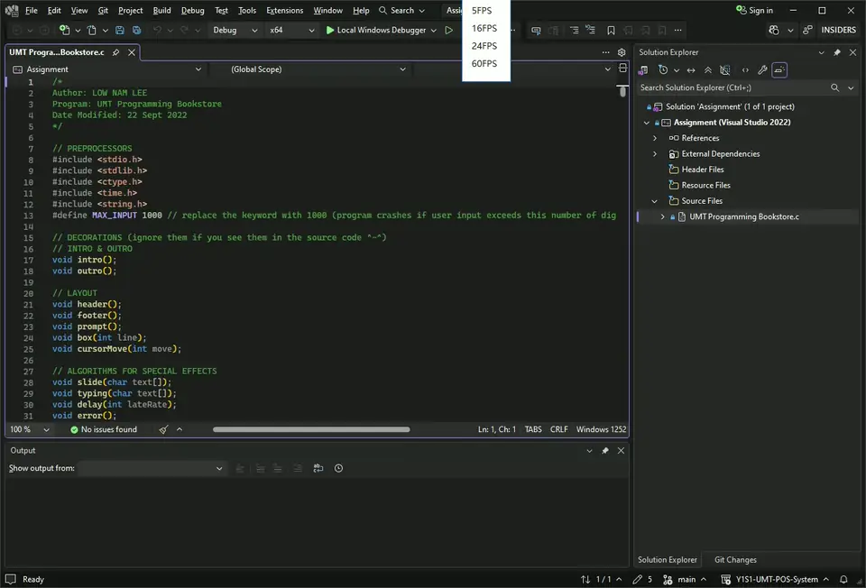
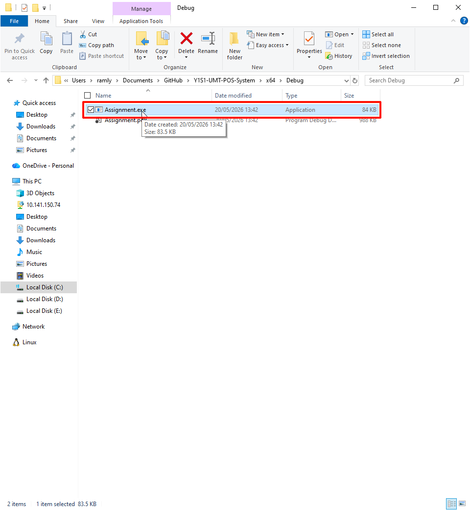
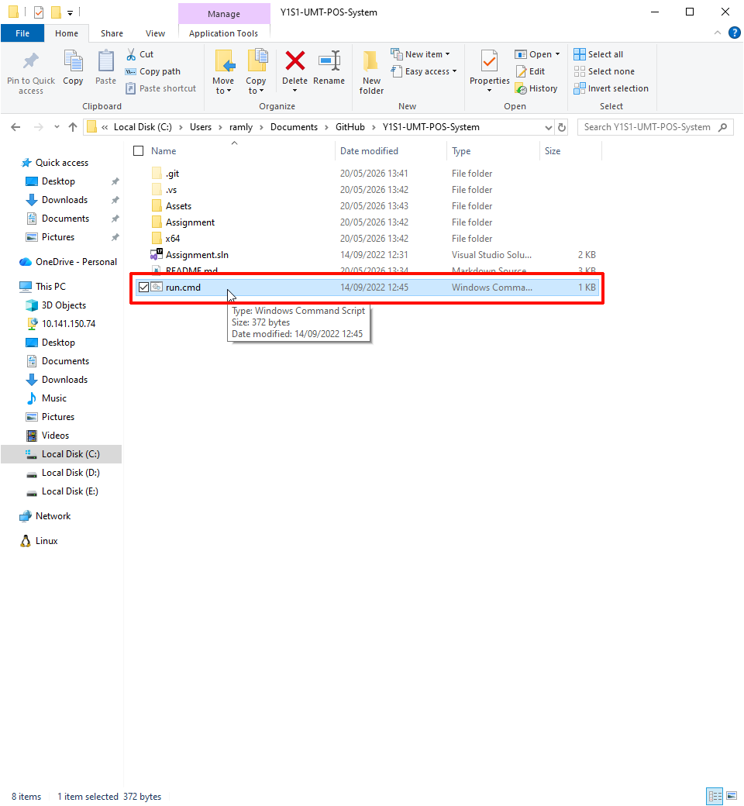
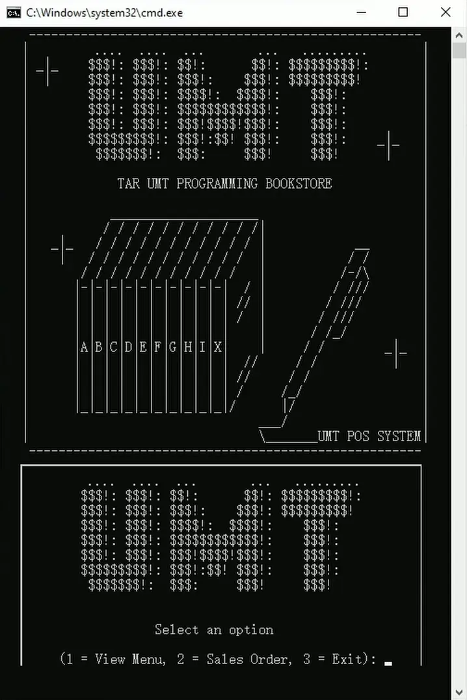
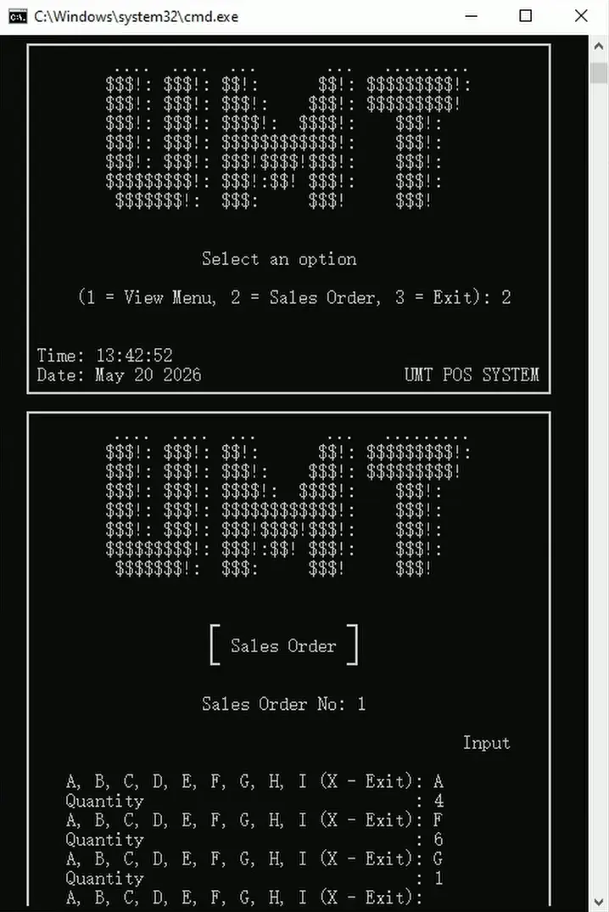
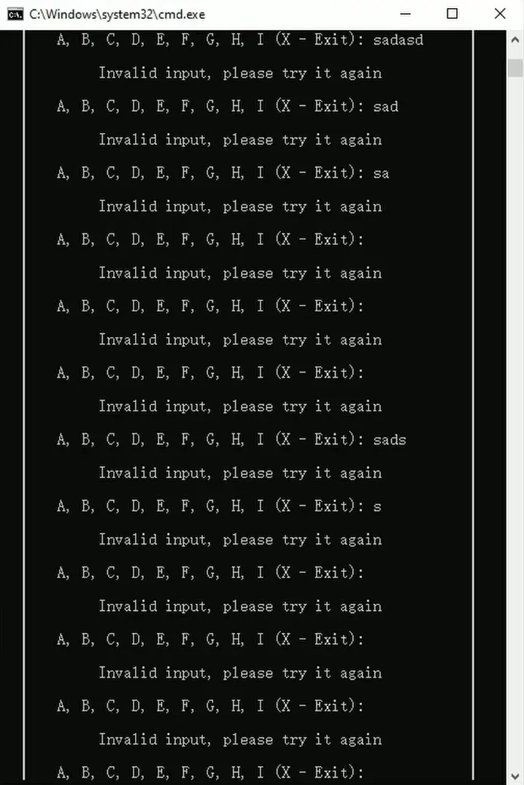
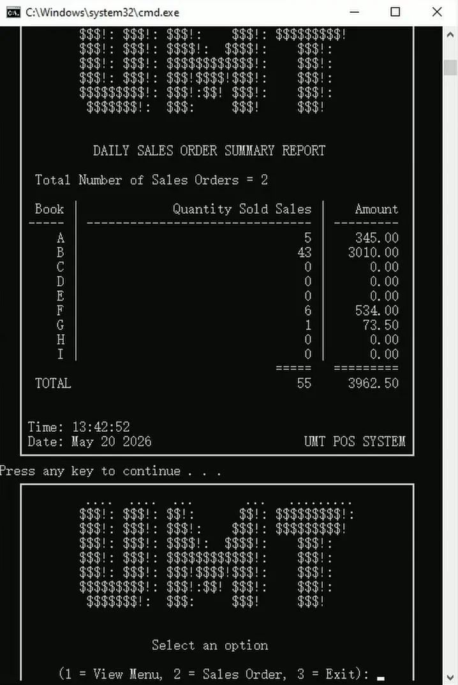
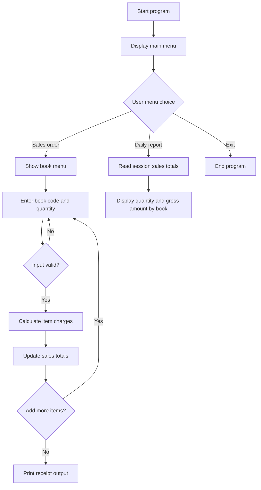

# Y1S1 UMT POS System

<p align="center">
  
</p>

<p align="center">
  
  
  
  
  
</p>

This is a repost of a simple system that I have done for **AACS1074 Programming Concepts & Design I** during my **Year 1 Semester 1** coursework in the **2022/2023 academic year**.

It is a small C console-based POS system for a fictional **UMT Programming Bookstore**. The project lets a user choose programming books, enter quantities, calculate totals and discounts, print receipt-style output, and review a daily sales report.

## What It Does

- Displays a bookstore menu with programming book categories.
- Accepts book codes and quantities for each order.
- Calculates item charges, subtotal, discount, and final payment.
- Shows receipt-style sales output for each transaction.
- Generates a daily summary report for all sales entered during the session.
- Handles invalid menu choices and incorrect sales input.

## Requirements

- Windows
- Microsoft Visual Studio with C/C++ project support
- Command Prompt for running the generated executable

## How To Install / Build

The executable is not stored in the repository. Build the Visual Studio project first, then run the generated `Assignment.exe`.

### 1. Open the Visual Studio solution

Open `Assignment.sln` in Microsoft Visual Studio. This loads the original coursework project and source file.

<p align="center">
  
</p>

### 2. Build the project

Select `Debug | x64`, then build the solution. After a successful build, Visual Studio creates the executable in the output folder, usually `x64\Debug`.

The screenshot below shows the generated `Assignment.exe` file in the build output folder. This is the program that will be launched after the project is built.

<p align="center">
  
</p>

## How To Run

### Option 1: Run with `run.cmd`

The easiest way to start the program is to double-click or run `run.cmd` from the repository root.

The screenshot below shows the helper command file. It changes the console code page to `936`, moves to the build output folder, and starts `Assignment.exe` for you.

<p align="center">
  
</p>

### Option 2: Run manually from Command Prompt

If you prefer to run the program manually, open Command Prompt in the build output folder, usually `x64\Debug`, then run:

```cmd
chcp 936
Assignment.exe
```

`chcp 936` changes the console code page so the program output displays correctly before the executable starts.

## How To Use

### 1. Start a sales operation

After the program starts, use the menu to begin a sales operation. The system displays the available books, accepts item codes, and lets the user enter quantities for each selected book.

<p align="center">
  
</p>

<br>

### 2. Enter valid choices and quantities

The program checks menu choices and sales entries before continuing. If the user enters an invalid option, the system displays a warning and asks for the input again instead of immediately processing incorrect data.

<p align="center">
  
</p>

<br>

### 3. Review the daily sales report

At the end of the workflow, the report screen summarizes the sales captured during the session. It helps the user review quantities sold and gross sales amounts by book.

<p align="center">
  
</p>

<br>

### 4. Exit the program

The exit flow gives the user a clear ending point after completing sales and report checking. This keeps the console interaction simple and guided.

<p align="center">
  
</p>

---

# Technical Reference

## Course and project details

| Field | Details |
| --- | --- |
| Course | AACS1074 Programming Concepts & Design I |
| Academic year | 2022/2023 |
| Programme | DFT |
| Tutorial group | Y1S1 G1 |
| Student | Low Nam Lee |
| Submission date | 24 September 2022 |
| Assignment title | UMT POS System |
| Program/source name | UMT Programming Bookstore |
| Language | C |
| IDE | Microsoft Visual Studio |
| Application type | Console application |

## System architecture

The diagram below shows the main control flow of the console program. The user interacts with the menu, the program validates input, sales data is processed, and the session data can later be shown in a summary report.



The program is structured around a repeated menu loop. Sales-order input updates in-memory totals, and the report option reads those totals to produce the daily summary. Invalid input returns to the same input step until the user provides an acceptable value.

## Bookstore scenario

The bookstore sells programming books across three categories:

- Software programming
- Web programming
- Mobile programming

Users choose book codes from the menu, enter quantities, and continue adding items until the order is complete.

## Pricing and discount logic

The original system used fixed book prices and these discount tiers:

- Subtotal above RM200: 5% discount
- Subtotal above RM300: 10% discount
- Subtotal above RM500: 15% discount

For each sales order, the program calculates:

1. Item charge
2. Subtotal
3. Discount amount
4. Final total

## Project structure

```text
.
|-- Assignment.sln
|-- Assignment/
|   |-- Assignment.vcxproj
|   |-- Assignment.vcxproj.filters
|   `-- UMT Programming Bookstore.c
|-- Assets/
|   |-- How-to-build-project.webp
|   |-- assignment-exe.png
|   |-- exit.webp
|   |-- intro.webp
|   |-- operation.webp
|   |-- report.webp
|   |-- run-cmd.png
|   `-- validation.webp
|-- README.md
`-- run.cmd
```

## Implementation notes

- Written as a structured C program.
- Uses arrays to store book quantities, prices, and sales totals.
- Uses functions for menu display, input handling, calculation, output, reporting, and console UI helpers.
- Built as a Microsoft Visual Studio console application.
- Uses standard C headers such as `stdio.h`, `stdlib.h`, `ctype.h`, `time.h`, and `string.h`.

<p align="center">
  Thanks for checking out this repost of my early C programming coursework.
</p>